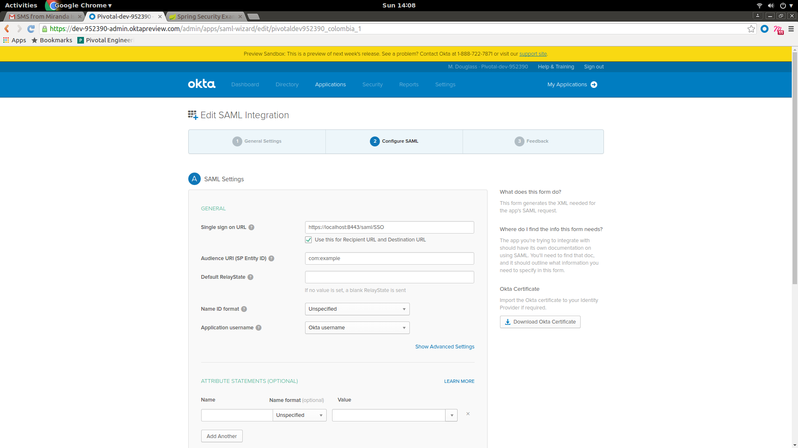

## Set up a test okta

#### Basic setup
1. Navigate to [http://developer.okta.com/](http://developer.okta.com/)
1. Click on *Sign Up*
1. Fill in your own name and email address to register, or login if you already have 
1. Okta will send you a confirmation email, including your temporary password and a link to your new developer Okta instance
1. Navigate to the link in the email, and input your email address and the temporary password provided to you
1. Fill in the form presented to complete your registration, and click on *Create My Account*
1. You should now have an empty Okta instance with no apps, and only one user.
1. Click on **< > Developer** in the top-left corner and switch to the Classic UI.

#### Create a test application
1. Click on *Admin*, then *Add Applications*
1. Click on *Create New App*
1. Click *Create New App*, select your platform (web, native, or SPA) and choose *SAML 2.0*
1. Give your app a name and click *Next*
1. Fill in *Single sign on URL* with `https://localhost:8443/saml/SSO`
1. Fill in *Audience URI* with `https://localhost:8443/saml/metadata`
1. Your config should look like this 
1. The rest of the fields can be left as they began, click *Next*
1. Select *I'm an Okta customer adding an internal app*
1. Check *This is an internal app that we have created*
1. Click *Finish*
1. Setup the metadata via url
    1. Copy and paste the Identity Provider metadata url into the application.yml under `security.saml2.metadata-url`
1. OR setup the metadata via xml
    1. Click *View Setup Instructions*
    1. Copy the xml IDP Metadata from the Optional section into a file in your project: `src/main/resources/saml/metadata.xml`
    1. Set metadataFilePath in SecurityConfiguration to the xml file (i.e. `metadataFilePath("saml/metadata.xml")`

#### Assign the test application
1. Return to your Okta home screen and click *Admin*
1. Click *Assign Applications*
1. Select the application you just created, yourself, then click *Next*
1. Click *Confirm Assignments*

## One time application setup

1. Generate a keystore and key in `src/main/resources/saml` with password `secret`:

`keytool -genkey -v -keystore keystore.jks -alias spring -keyalg RSA -keysize 2048 -validity 10000`

## Running the app

1. `./gradlew clean bootRun`
1. Navigate to `http://localhost:8443`
